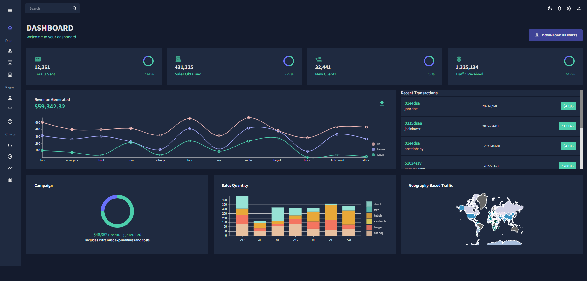

# Admin Dashboard Application

This is a [Next.js](https://nextjs.org/) project bootstrapped with [`create-next-app`](https://github.com/vercel/next.js/tree/canary/packages/create-next-app).

## Project overview

The purpose of this project is to demonstrate a fully functional Frontend Admin Dashboard by using the best practices in next.js and react.



## External libraries or Frontend stacks:

- TypeScript
- React FullCalendar (https://fullcalendar.io/)
- MUI (offers a comprehensive suite of UI tools to help you ship new features faster)
- MUI DataGrid Table
- Formik (building forms)
- yup (a schema builder for runtime value parsing and validation)
- Emotion library (designed for writing css styles with JavaScript)
- React dom
- Nivo (nivo provides a rich set of dataviz components, built on top of D3 and React.)
- React Charts (the most popular charting library.)

## Getting Started

First, run the development server:

```bash
npm run dev
```

Open [http://localhost:3000](http://localhost:3000) with your browser to see the result.
